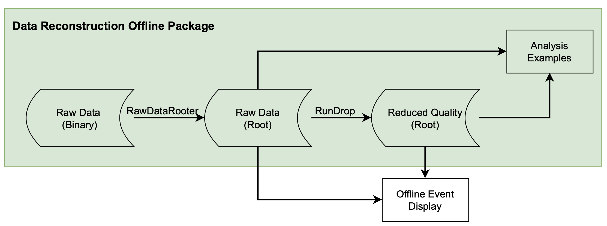

# About DROP

**D**ata **R**econstruction **O**ffline **P**ackage (**DROP**) is a collection of python toolbox to process and analyze the data collected by the Water-based Liquid Scintillator (WbLS) 1-tonne demonstrator. The binary decoder part is based on [CAENReader](https://github.com/tlangfor/CAENReader). The rest is developed according to the needs of BNL WbLS experiment, although it can be extended for other experiments.



The write access to this gitlab repoistory is grant to the WbLS group, or individual invitation-only. For developer & maintainer access, please contact Xin: <xxiang@bnl.gov>

# Getting Started

## Prerequisites

- Minimal Python3 Dependence:
  - uproot 4.1.0+
  - numpy 1.20.0+
  - pyYAML 5.1+
  - scipy, matplotlib (?+)

The full dependence is specified in requirememts.txt.

## Installation and Setup

Download is open to public, but write permission is limited to BNL Intensity Frontier (BNLIF).

Upgrade your pip (optional) to keep up to date with the dependence requirement:
```bash
pip install --upgrade pip
```

Create a virtual environment and activate it (optional):
```bash
python3 -m venv env
source env/bin/activate
```
If everything goes right, you are now in a virutial environment named `env`. If you do not know how to use virtial enironment, check out [here](https://packaging.python.org/en/latest/guides/installing-using-pip-and-virtual-environments/). The same page also includes instruction on how to use `pip`. Both `venv` and `pip` are common tools for python users.

Install the exact package dependence from requirement within your virtual env (optional).
```bash
pip install -r requirements.txt
```
Alternatively, you can pip install package one by one.

## Usage

Enter virtual environment if not already in (recommneded):
```
source env/bin/activate
```

Source the setup script in the drop directory. This will setup a few enviromental variables needed.
```bash
source setup.sh
```

To convert the raw data from binary file to root file, check out the rooter:
```bash
python src/raw_data_rooter.py --help
```
The rooter is fairly fast. Please check the global parameters (ALL CAP) defined at the beginning of this script; they may not affect the output root file, but may affect the processing speed and the accuracy of the print out.


In your virtual env (recommended), check out the help manual.

```bash
python src/run_drop.py --help
```

**Note: the pipeline is still under-development. For example, the RQ file saved into a root tree has a limited number of branches. **

When you're done, exit the virtual env:

```
deactivate
```

# Contributing

## Git Workflow
The main(master) branch is protected. The typical workflow is:

1. On main (master) branch, start a new branch:
```bash
git branch <new-branch>
```
I recommend including your initials to the new branch new, such as `xx-fix_blah_blah`.

2. Switch to the new local branch you created:
```bash
git checkout <new-branch>
```
3. Make your edit

4. Commit and push your change to remote branch:
```bash
git commit -m "this is what I did"
git push origin <new-branch>
```

5. After you've make sure your code actually runs, create a new pull request at https://github.com/BNLIF/drop/pulls to merge your branch to the main (master)

> **_Note_**: Please ask help if you're not familiar with git at all. `git` is a common tool for software collaboration.

## Style
**Style**. I tried to follow [PEP 8](https://realpython.com/python-pep8/) convention as much as possible. Not a requirement, but I hope you do it too so that we have a clean and consistent coding style. For quick formating, you can use `black` or other automatic formating software. `black` will not change variable naming for you.

For your connivence, here is a summary of the style.

### Naming Styles
| **Type**    | **Naming Convention**         | **Examples**               |
|:------------|-------------------------------|----------------------------|
| Function | Use a lowercase word or words. Separate words by underscores to improve readability.| `function`, `my_function` |
| Variable | Use a lowercase single letter, word, or words. Separate words with underscores to improve readability.  |  `x`, `var`, `my_variable` |
| Class | Start each word with a capital letter. Do not separate words with underscores. This style is called camel case or pascal case.  | `Model`, `MyClass`  |
| Method | Use a lowercase word or words. Separate words with underscores to improve readability.  | `class_method`, `method`  |
| Constant	 | Use an uppercase single letter, word, or words. Separate words with underscores to improve readability.  | `CONSTANT`, `MY_CONSTANT`, `MY_LONG_CONSTANT`  |
| Module | Use a short, lowercase word or words. Separate words with underscores to improve readability.	  | `module.py`, `my_module.py`  |
| Package  |  Use a short, lowercase word or words. Do not separate words with underscores.	 |  `package`, `mypackage` |

Also, function starts with underscores are not meant for users to call. This is a python naming convention, not strictly enforced. For example,
 - `_single_leading_underscore`: weak "internal use" indicator. E.g. from M import * does not import objects whose name starts with an underscore
- Double pre underscores are used for the name mangling.
- Double underscores before and after are reserved for python. For example, `__init__`. DO NOT make yours.

### Indentation

- Use 4 consecutive spaces to indicate indentation.
- Prefer spaces over tabs.

> **_Note_**: You can adjust the settings in your text editor to output 4 spaces instead of a tab character, when you press the Tab key.

### Comments

Use comments to document the code!!!

Documentation strings, or docstrings, are strings enclosed in double (""") or single (''') quotation marks that appear on the first line of any function, class, method, or module. You can use them to explain and document a specific block of code.

The most important rules applying to docstrings are the following:

- Surround docstrings with three double quotes on either side, as in """This is a docstring""".
- Write them for all public modules, functions, classes, and methods.
- Put the """ that ends a multiline docstring on a line by itself:

For example,
```python
def quadratic(a, b, c, x):
    """Solve quadratic equation via the quadratic formula.

    A quadratic equation has the following form:
    ax**2 + bx + c = 0

    There always two solutions to a quadratic equation: x_1 & x_2.
    """
    x_1 = (- b+(b**2-4*a*c)**(1/2)) / (2*a)
    x_2 = (- b-(b**2-4*a*c)**(1/2)) / (2*a)

    return x_1, x_2
```
